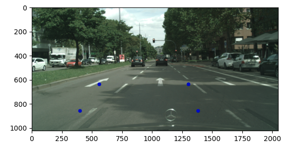

# Birds-Eye-View (BEV) Perception Pipeline

An autonomous driving perception framework engineered to transform monocular perspective frames into top-down, Birds-Eye-View representations using three distinct spatial geometry strategies. 

The figures below demonstrate the execution of the 4-point Homography Inverse Perspective Mapping (IPM) pipeline using a sample frame:

| 1. Perspective View with Source Anchor | 2. Generated Bird's-Eye-View (BEV) Ground Plane |
| :---: | :---: |
|  |  |
| *Figure 1: Original monocular frame with 4 selected ground-plane control anchors.* | *Figure 2: Orthographic top-down transformation isolating lane boundaries.* |
---

## Pipeline Architecture

This repository showcases a modular, production-grade software architecture for autonomous vehicle perception. The core pipeline implements three foundational spatial transformation strategies:

1. **Inverse Perspective Mapping (IPM) via 4-Point Homography**  
   Planar ground transformations derived directly from 2D-to-2D homography estimation vectors.
   
2. **Parametric IPM**  
   Rigid-body transformations leveraging explicit camera Intrinsic ($K$) and Extrinsic ($[R|T]$) matrices to project metric ground planes.
   
3. **Depth-Integrated IPM**  
   Back-projects 2D pixel frames into dense 3D camera-space coordinates using discrete depth profiles, eliminating planar assumptions for complex environments.

> 💡 **Note:** Internal mathematical loops are abstracted to preserve core algorithmic confidentiality while fully demonstrating high-integrity software topology.

---

## Dataset & Calibration Drift Analysis

The pipeline is validated using the **KITTI dataset** to analyze how spatial layout fidelity behaves under synthetic calibration drift. By introducing controlled disturbances to pitch, roll, and focal length, the framework tracks error propagation matrices to evaluate model robustness for physical vehicle deployments.